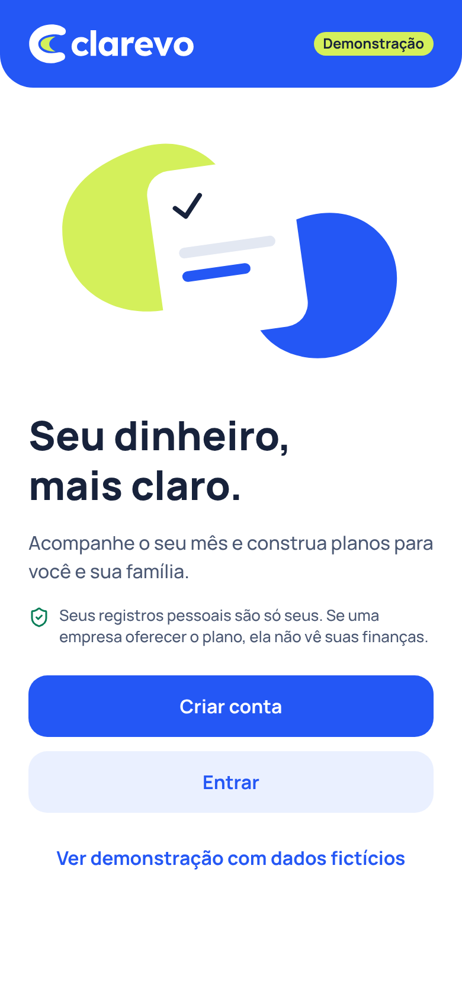
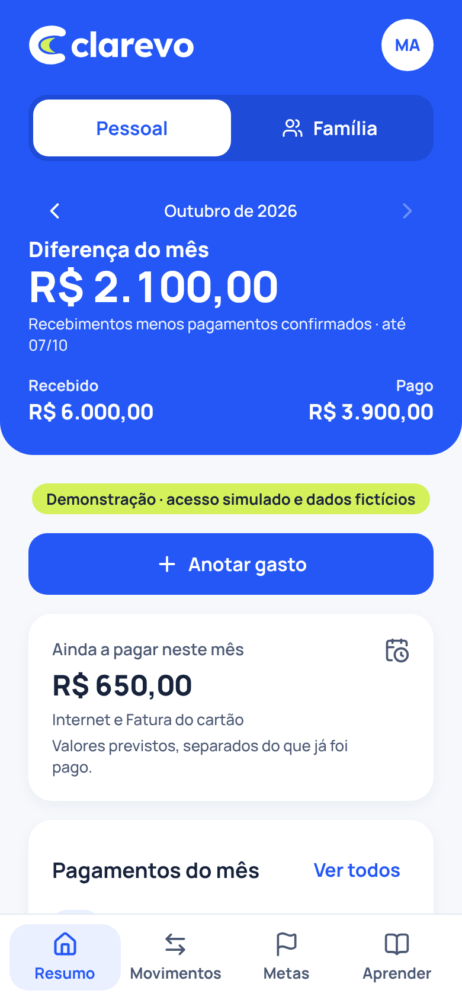
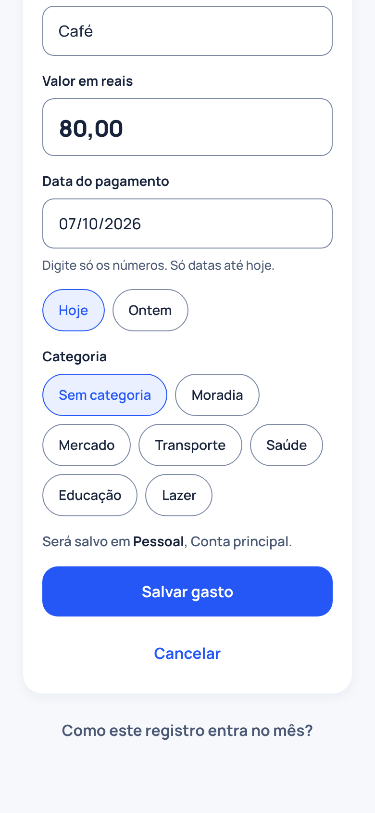
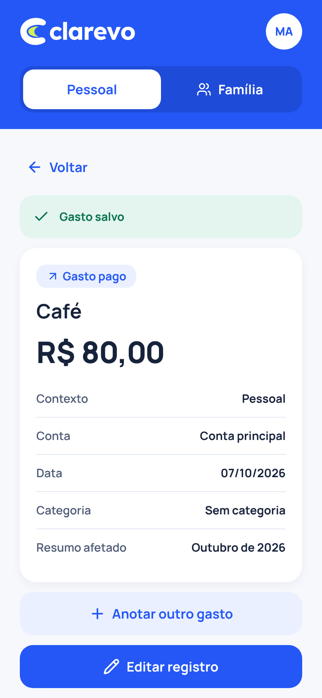

# Clarevo

Organização e educação financeira para pessoas e famílias, com fundação preparada para empresas oferecerem o plano como benefício.

<p>
  
  
  
  
</p>

Primeiro ciclo: 07/10/2026. Sem Supabase configurado, o app roda em **demonstração** (acesso simulado e dados fictícios, com selo visível).

## O que funciona

- Entrada: boas-vindas, criar conta, confirmar e-mail, entrar, recuperar acesso e nova senha.
- Sua primeira conta, criada uma única vez.
- Gasto pago e recebimento já recebido: anotar, conferir no detalhe, editar e excluir com confirmação.
- Resumo do mês e composição de cada total pela mesma origem; troca de mês.
- Rascunho preservado, aviso antes de descartar, estados de carregamento, erro e vazio.
- Banco com permissões por pessoa, contexto e ação; empresa não vê finanças.

## Como rodar

Requer Node 22.12 ou mais recente.

```bash
npm install
npm run web        # navegador (em desenvolvimento, sem Supabase, abre em demonstração)
npm run app        # celular com o app Expo Go (QR code)
```

Uma versão web de demonstração para apresentar: `npm --workspace apps/app run export:demo` (gera `apps/app/dist`). Um build de produção sem Supabase configurado mostra "Configuração incompleta" em vez de abrir a demonstração.

## Como verificar

```bash
npm test           # regras financeiras (core)
npm run typecheck
npm run test:db    # permissões e sequência de aceite no banco (Postgres local)
npm run test:api   # código do app contra a API real do banco (PostgREST)
npm run test:web   # fluxos completos na versão web (Playwright)
```

## Documentação

1. [Visão e decisões](docs/00_VISAO_E_DECISOES.md)
2. [Arquitetura](docs/01_ARQUITETURA.md)
3. [Regras financeiras](docs/02_REGRAS_FINANCEIRAS.md)
4. [Acesso e permissões](docs/03_ACESSO_E_PERMISSOES.md)
5. [Roteiro até o lançamento](docs/04_ROTEIRO_LANCAMENTO.md)
6. [Ligar ao Supabase](docs/05_SUPABASE.md)
7. [Marca](docs/marca/) e [telas](docs/telas/)
8. [Análise e propostas (07/10/2026)](docs/06_ANALISE_E_PROPOSTAS.md)
9. [Referências recebidas](docs/referencias/)
